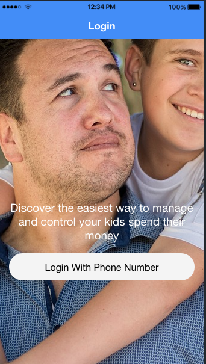
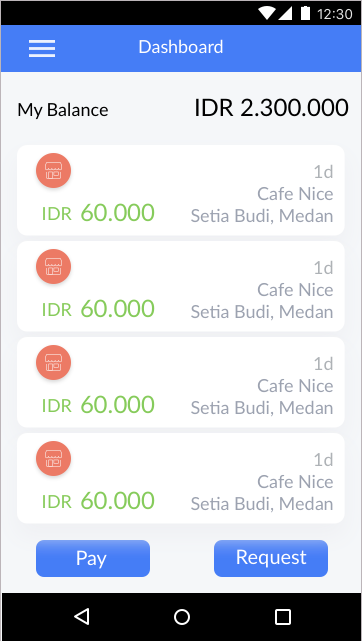
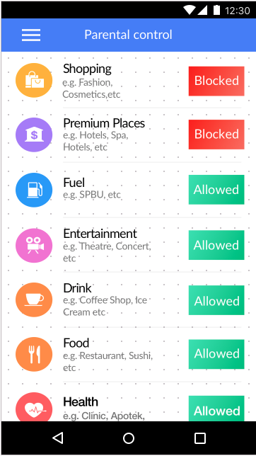
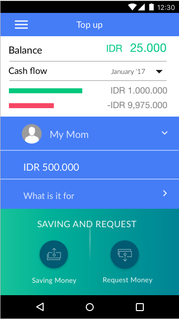
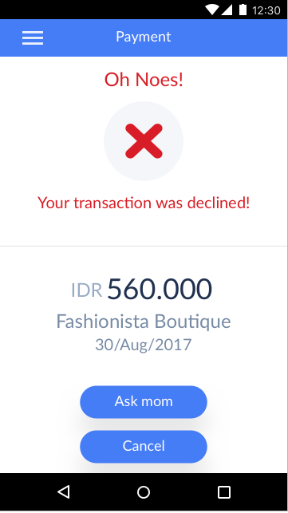
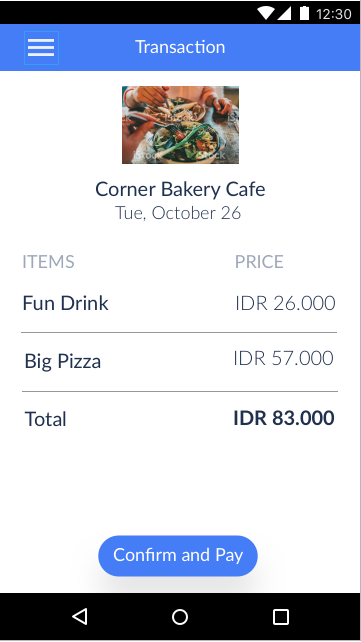

# PAYARI
<h4> ENGLISH </h4>
An app that helps parents to make payments and controls the child's needs through mobile phones.
This application is built using Progressive Web Apps technology. You can access the prototype of this application at the following link

<h4> INDONESIA </h4>
Sebuah aplikasi yang membantu orang tua untuk melakukan pembayaran dan kontrol akan kebutuhan anak melalui ponsel. 
Aplikasi ini dibangun menggunakan teknologi Progressive Web Apps. Anda Dapat mengakses prototype aplikasi ini pada link berikut

http://188.166.177.2/payari/www/ 
(Best View On Mobile Phone)

## THIS APPS USE TELKOM XSIGHT API
<h4> English </h4>
1. <a href="http://www.telkomxsight.com/in/web/telkom/telkomapi-docs?apiName=ArcGIS&version=0.0.2"> ArcGIS</a>
ArcGIS Used For Merchant Location Mapping On  Applications 
2. <a href="http://www.telkomxsight.com/in/web/telkom/telkomapi-docs?apiName=SMSOTP&version=1.0.1">SMS OTP</a>
SMS OTP Used For User Authentication 
3. <a href="http://www.telkomxsight.com/in/web/telkom/telkomapi-docs?apiName=SMSNotification&version=1.0.0">SMS NOTIFICATION</a>
SMS Notifikasi Used For Notice to the user about what happens about the user account in the application 
4. <a href="http://www.telkomxsight.com/in/web/telkom/telkomapi-docs?apiName=TMoney&version=1.0.0-sandbox">TMoney</a>
TMoney Used To Become A Place Of Money Storage And Transactions In The Application

<h4> Indonesia </h4>
1. <a href="http://www.telkomxsight.com/in/web/telkom/telkomapi-docs?apiName=ArcGIS&version=0.0.2"> ArcGIS</a>
ArcGIS Digunakan Untuk Pemetaan Lokasi Merchant Pada Aplikasi 
2. <a href="http://www.telkomxsight.com/in/web/telkom/telkomapi-docs?apiName=SMSOTP&version=1.0.1">SMS OTP</a>
SMS OTP Digunakan Untuk Authentikasi User Pada Aplikasi 
3. <a href="http://www.telkomxsight.com/in/web/telkom/telkomapi-docs?apiName=SMSNotification&version=1.0.0">SMS NOTIFICATION</a>
SMS Notifikasi Digunakan Untuk Pemberitahuan kepada user tentang apa saja yang terjadi mengenai akun user di aplikasi 
4. <a href="http://www.telkomxsight.com/in/web/telkom/telkomapi-docs?apiName=TMoney&version=1.0.0-sandbox">TMoney</a>
Tmoney Digunakan Untuk Menjadi Tempat Penyimpanan uang dan transaksi uang di aplikasi

## Demo

  
  
  
  

   
  
  

  

### Contribution Process

1. Submit an issue describing your proposed change to the repo in question.
1. The repo owner will respond to your issue promptly.
1. Fork the desired repo, develop and test your code changes.
1. Ensure that your code adheres to the existing style of the library to which
   you are contributing.
1. Ensure that your code has an appropriate set of unit tests which all pass.
1. Submit a pull request and cc @iqbalhood

